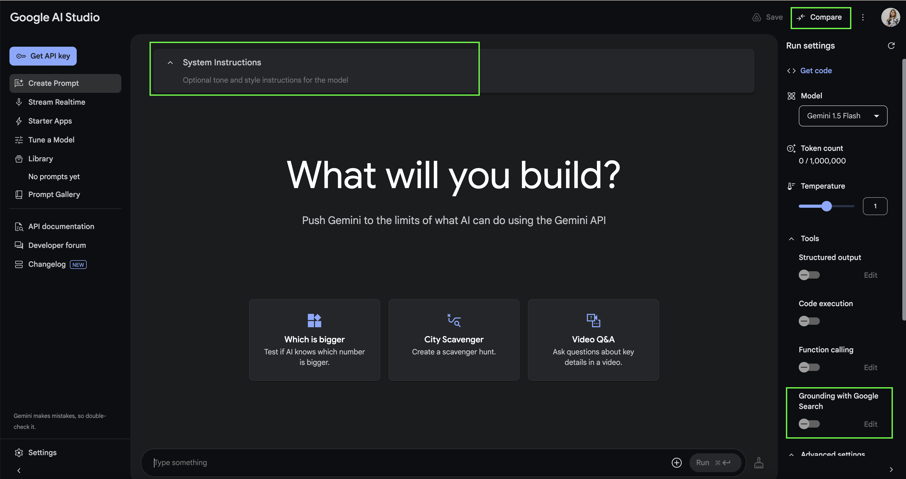
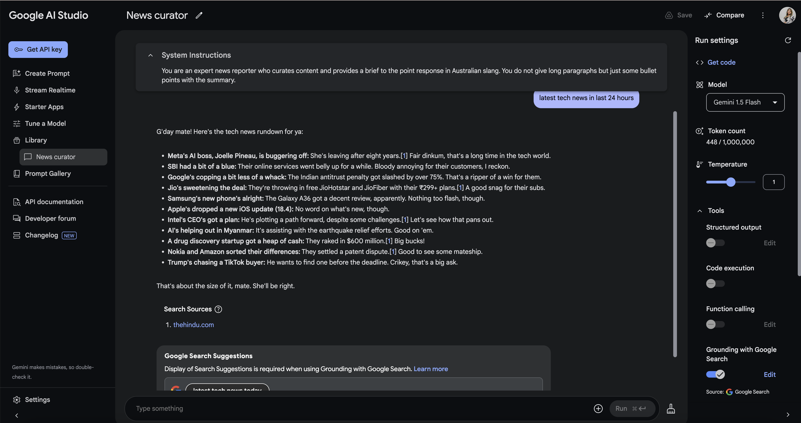
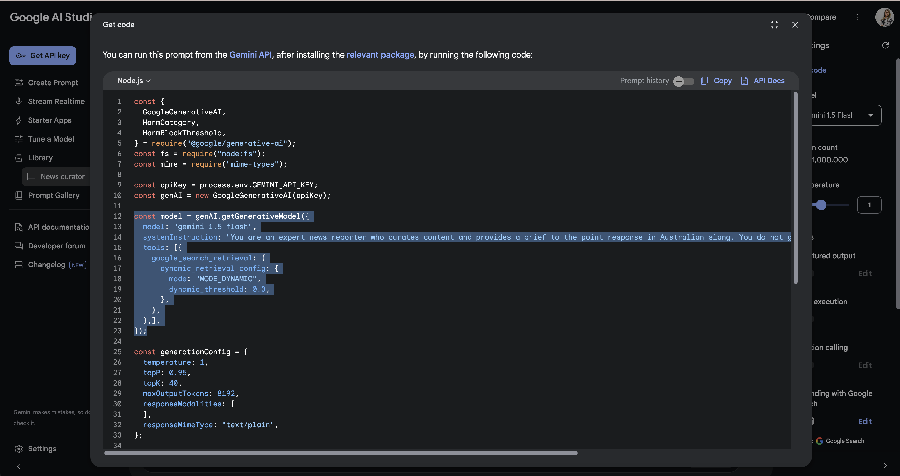
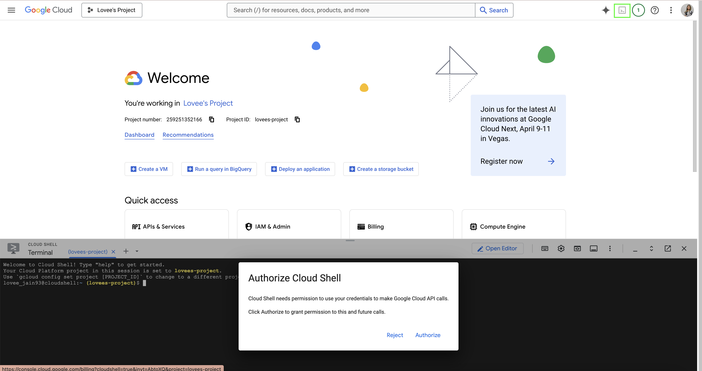
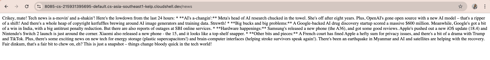
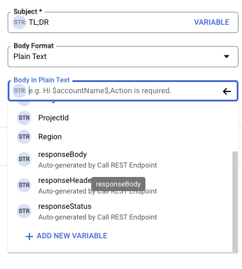
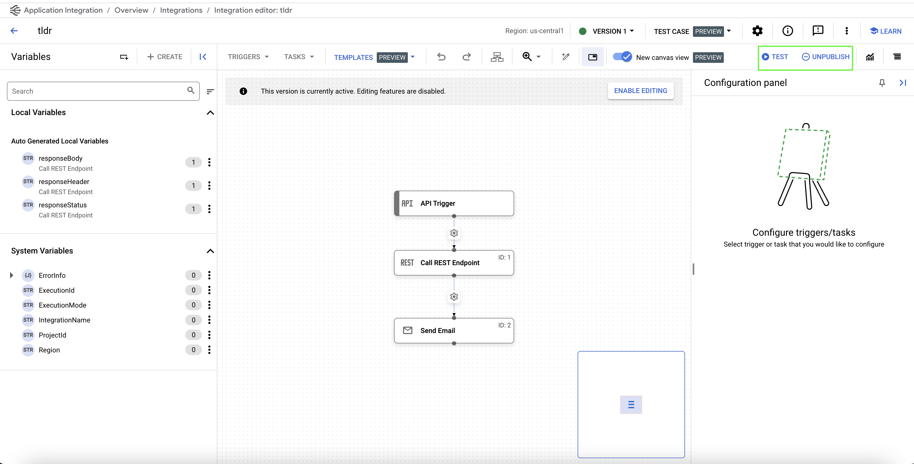
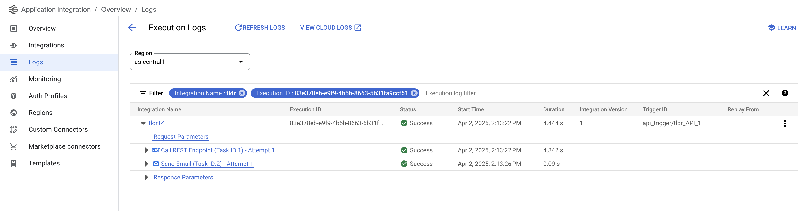
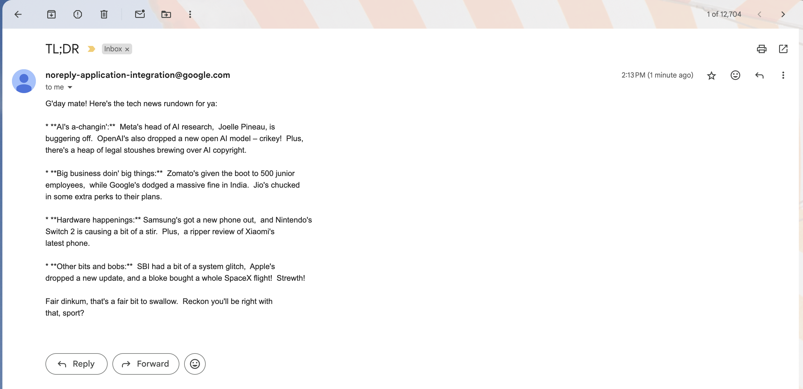

summary: Build Your Own Tech News TL;DR App: Grounding, Cloud Run & No-Code Email Automation
id: gemini-tldr-app
tags: gcp, generativeai, gemini, workshop
status: Published 
authors: Lovee Jain
Feedback Link: https://zarin.io

# Build Your Own Tech News TL;DR App
<!-- ------------------------ -->
## Overview
Duration: 5

In this codelab, you'll learn how to build your own personalised "Too Long; Didn't Read" (TL;DR) tech news application. We'll leverage the power of the Gemini API and the Google Search Retrieval Tool to create a backend API that fetches and summarises the latest tech news based on your interests. Once our API is ready, we'll deploy it effortlessly on Google Cloud Run. 
Finally, we'll harness the simplicity of Google Cloud's Application Integration to create a low-code/no-code automation that calls our API and delivers the curated news digest directly to your email inbox. Get ready to streamline your news consumption!


### What You’ll Learn

- using AI Studio and Gemini API, compare feature
- grounding with Google search to get real-time information from Google search results
- creating an Express API and deploying it on Cloud Run
- low-code/no-code automation using Google Application Integration


### Evolving Space
Just want to highlight the fact that this is an evolving space and hence there are new changes everyday. When I wrote this codelab, I used Gemini 1.5 Flash model with [Gemini SDK](https://www.npmjs.com/package/@google/generative-ai) which is now deprecated, and therefore, I have updated the code with latest models and the new [GenAI SDK](https://www.npmjs.com/package/@google/genai), however, have left some old screenshots from AI Studio, for you to understand and compare.

- [Latest code for this lab uses GenAI SDK](https://github.com/Lovee93/news-curator)
- Checkout `vertex-implementation` [branch](https://github.com/Lovee93/news-curator/tree/vertex-implementation) for vertex-ai implementation of the codelab
- Checkout `2.0-plus-models` [branch](https://github.com/Lovee93/news-curator/tree/2.0-plus-models) for playing around with 2.0+ models with Gemini SDK
- Checkout `use-gemini-sdk` [branch](https://github.com/Lovee93/news-curator/tree/use-gemini-sdk) for original old code with Gemini SDK and Gemini 1.5 Flash model

<!-- ------------------------ -->
## Getting started with AI Studio
Duration: 10

1. Let's navigate to: [AI Studio](https://aistudio.google.com/) and get familiarised with all the features available:




**Please note:** We will be using **Gemini 2.5 Flash Preview** model all across our workshop.

2. Next, let's enter into Compare Mode and turn on Grounding with Google Search on the right side. And ask it something current and see the difference!


3. Let's close this and construct a new prompt for our TL;DR app! We will make use of System Instructions:

**You are an expert news reporter who curates content and provides a brief to the point response in Australian slang. You do not give long paragraphs but just some bullet points with the summary.**


4. We can then use the prompt to request the type/category of news we are interested in. I'll use tech!




5. I'm happy with the result so next I would like to get the code for this. Go to Get code and select Node.js and turn off Prompt history. What we are interested in is the highlighted parts of code below. 




6. Copy the code and paste it in an editor/notepad, we will use bits from it in the next steps.

<!-- ------------------------ -->
## Create a basic Express API
Duration: 15

1. Let's go to the [cloud console](https://console.cloud.google.com/). 
I imagine by this step, you already have redeemed your cloud credits, created a project and are in that project on the console. 

Click on the Activate Cloud Shell button on top right and authorise the cloud shell. 



2. Once active, let's create a new directory called *news-curator* and initialise a node app by running following commands:

```
mkdir news-curator
cd news-curator
npm init -y
touch index.js
```

3. Once done, click on Open Editor button to start editing in a proper IDE.

4. Let's set up a basic Express API endpoint by pasting in the following code in `index.js`:

```
import express from "express";
import dotenv from "dotenv";

const app = express();
app.use(express.json());
dotenv.config();
const port = process.env.PORT || 3000;

app.listen(port, async () => {
	console.log(`Server is running on port ${port}`);
});

app.get("/", (req, res) => {
	res.send("Hello World");
});
```
5. Next, create a `.env` file with the following variable:

```
PORT = 8080
```

6. Next, update `package.json` by adding following scripts and also updating the type to `module` to support import statements.

```
"scripts": {
	"start": "node index.js",
	"dev": "nodemon index.js",
	"test": "echo \"Error: no test specified\" && exit 1"
},
"type": "module",
```

7. Let's Open Terminal and install the packages we need:

```
npm install express dotenv nodemon
```

This is what your `package.json` should look like after installing the packages:
```
{
	"name": "news-curator",
	"version": "1.0.0",
	"description": "",
	"main": "index.js",
	"type": "module",
	"scripts": {
		"start": "node index.js",
		"dev": "nodemon index.js",
		"test": "echo \"Error: no test specified\" && exit 1"
	},
	"keywords": [],
	"author": "",
	"license": "ISC",
	"dependencies": {
		"dotenv": "^16.4.7",
		"express": "^4.21.2",
		"nodemon": "^3.1.9"
	}
}
```
8. Let's now run our app:

```
npm run dev
```

Your application will now be running on port 8080 and you can view it by clicking on the Web Preview button, which will take you to a new page that will say *Hello World*.

Your basic express API is now initialised and working!

<!-- ------------------------ -->
## Add the Gemini magic!
Duration: 20

In this step we will be adding Gemini with Google search grouding bits of code and create a new API endpoint.

1. Before we do that, we first need to grab the Gemini API key from the AI studio. Go to Get API Key and then paste it in your `.env` file.

```
GEMINI_API_KEY = //YOUR_API_KEY
```

2. Next, we will pick and choose from the code we got from AI Studio in the previous step. If you don't have it, you can grab it from your prompt > Get code.

3. We will be updating our `index.js` file. So let's first start by importing the GenAI package:  

```
import { GoogleGenAI } from "@google/genai";
```

4. Next, we are going to initialise the Gemini API client.

```
const apiKey = process.env.GEMINI_API_KEY;
const geminiAI = new GoogleGenAI({apiKey});
```

5. Next, create a new endpoint `/news` where you pass in the prompt to get the *latest tech news* to your model. First you initialise a chat and then send the prompt as message to your chat and wait for the result to come back:

```
app.get("/news", async (req, res) => {
  const prompt = "latest tech news in last 24 hours"
  // Initialize the chat with the model and tools
  const chat = await geminiAI.chats.create({
    model: "gemini-2.5-flash",
    config: {
      tools: [
        {
          googleSearch: {}
        }
      ],
      systemInstruction: "You are an expert news reporter who curates content and provides a brief to the point response in Australian slang. You do not give long paragraphs but just some bullet points with the summary."
    }
  })
  // Send the prompt and wait for the result
  const result = await chat.sendMessage({"message": prompt})
  res.send(result.text);
})

```

Don't worry, if you missed the above steps, you can find the `index.js` and whole code on [Github](https://github.com/Lovee93/news-curator).

7. Let's go back to the terminal and install the package:

```
npm install @google/genai
```

8. And then run our application:

```
npm run dev
```

Browse to the Web Preview and update the url to add `/news` and you will now get some curated news items!



Tada! 🎉 Your API is ready!

<!-- ------------------------ -->
## Deploy your app
Duration: 10

It's time to deploy our application to Cloud Run!

Go to terminal and enter the following command to enable the Cloud Build and Run APIs first:

```
gcloud services enable run.googleapis.com \
cloudbuild.googleapis.com
```

[OPTIONAL] If you get an error and it needs you to authorise first, just run: 

```
gcloud auth login
```

Once you have enabled the APIs, you can now deploy using:


```
gcloud run deploy news-curator --source . --region us-central1 --allow-unauthenticated
```

**Note:** We are allowing unauthenticated invocations for now - **Don't do this in Production**.

It will use Buildpack to create a container image of your application and then push it to the registry.  Next, it will create and manage container instances by pulling this image from the registry.

Once done, you should be able to see a service URL, try it:

  `https://news-curator-123456789.us-central1.run.app/news`

Congratulations, you have done the hard part! It's time to do some automation!

<!-- ------------------------ -->
## Send curated news to your email
Duration: 15

In your [Cloud Console](https://console.cloud.google.com/), search for application integration and create a new integration. 

1. Give it a name, `tldr`.
2. Description: `Sends curated tech news to me!`
3. Once created, you will see a blank canvas.
4. Click on Trigger and select API Trigger.
5. Configure API Trigger with the default settings.
6. Next, add a Task, select Call Rest Endpoint and configure it with following settings:
	a. Authentication: Run as service account
	b. Endpoint base URL: [https://news-curator-123456789.us-central1.run.app/news](https://news-curator-123456789.us-central1.run.app/news)
7. Add another Task, search for Send Email and configure it with following settings:
	a. Add your email in recipient
	b. Add a subject, e.g. *TL;DR*
	c. And in the body try selecting Variable, you should be able to find `responseBody` as an autogenerated variable from Call Rest Endpoint step. 
	


8. Don't forget to connect your steps and then publish! It can autogenerate the description for you - Save and Publish 🚀 




9. Let's test it!!! Don't forget to View logs:




10. You should have got an email like the following. It can sometimes end up in Spam, so make sure you check it!




Congratulations, you have now created your personal TL;DR app that runs whenever you call it! 🎉

<!-- ------------------------ -->
## What's next?
Duration: 5

Well done on creating your own TL;DR app, but isn't it missing something? 

While it is working every time you are triggering it manually, what you want is to get your news bytes daily. And for that you need to update your API trigger to a Schedule Trigger!

Setting up Schedule Trigger is easy, all you need to do is provide the time of the day and frequency. Now you can do that in the basic tab or go to advanced and provide a cron time in the configuration panel. 
**However, what you want to be careful about is the difference in timezone.** 
*All time settings are GMT 08:00 - America/Los Angeles.*

Now, I am not an expert at it, so I ask Gemini to give me the correct time conversion value and it works! I get my daily updates at 8 pm everyday 😉

Are you ready to set up yours? 

### Resources:
Github Respository: [https://github.com/Lovee93/news-curator](https://github.com/Lovee93/news-curator)